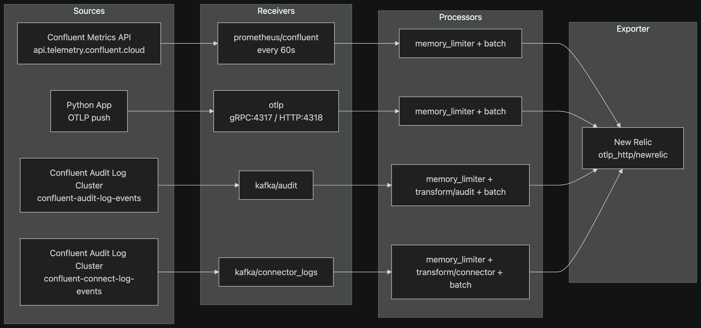

# Python Kafka Monitoring with New Relic

Runnable producer and consumer examples for monitoring Python Kafka applications and exporting metrics to New Relic via an OpenTelemetry Collector. The bundle covers three client libraries (`confluent-kafka`, FastStream/confluent, FastStream/aiokafka) and includes ready-to-import dashboards for both local Confluent Platform and Confluent Cloud.

## Architecture



Python producer and consumer applications instrument themselves with OpenTelemetry and push metrics over OTLP/gRPC to a local OpenTelemetry Collector. The Collector batches and forwards them to New Relic over OTLP/HTTP. This is the recommended path for production: the Collector holds the license key centrally, buffers metrics across many services, and lets you add processors (redaction, sampling, multi-backend fan-out) without touching application code.

For simpler setups, the Collector can be skipped — see [Alternative: direct to New Relic](#alternative-direct-to-new-relic).

The `librdkafka` statistics callback emits detailed client diagnostics (queue depth, broker connectivity, byte rates) as structured JSON logs. These are kept in logs rather than metric dimensions to avoid high-cardinality instrumentation.

For Confluent Cloud, a second pipeline in the Collector scrapes the Confluent Metrics API and ingests audit and connector logs from dedicated Kafka topics, giving full cluster-side visibility alongside application metrics.

## Contents

| Path | Description |
|---|---|
| `python/confluent_kafka/` | Plain `confluent-kafka` producer, consumer, metrics, Kafka config |
| `python/faststream_confluent/` | Same example on FastStream + `confluent-kafka`/librdkafka |
| `python/faststream_aiokafka/` | Same example on FastStream + `aiokafka` |
| `collector/otel-collector.yaml` | Collector pipeline for local Kafka |
| `collector/otel-collector-ccloud.yaml` | Collector pipeline for Confluent Cloud (metrics + audit/connector logs) |
| `docker-compose.cp.yml` | Local stack: Kafka broker + OTel Collector + JMX exporter |
| `docker-compose.ccloud.yml` | Confluent Cloud stack: OTel Collector only |
| `env.example` | Configuration template |
| `dashboards/newrelic-dashboard-python.json` | Python app metrics dashboard |
| `dashboards/newrelic-dashboard-cp.json` | Confluent Platform broker dashboard (7 pages, JMX-based) |
| `dashboards/newrelic-dashboard-ccloud.json` | Confluent Cloud cluster dashboard |
| `dashboards/newrelic-dashboard-ccloud-logs.json` | Confluent Cloud audit + connector log dashboard |
| `deploy_nr_dashboard.sh` | Idempotent NerdGraph dashboard deploy script |

> **Always run examples from the repository root** as `python -m python.<package>.<module>`. Never `cd python && python -m ...` — `python/confluent_kafka/` shares its name with the real PyPI package and would shadow it.

## Prerequisites

* Python 3.9+
* Docker and Docker Compose (for the included local Kafka/Collector)
* New Relic ingest key (`NEW_RELIC_LICENSE_KEY`)
* `jq` (only needed for `deploy_nr_dashboard.sh`)

## Quick start — local Kafka

```bash
python3 -m venv .venv && . .venv/bin/activate
pip install -r requirements.txt
cp env.example .env
# Set NEW_RELIC_LICENSE_KEY and NEW_RELIC_OTLP_ENDPOINT in .env
# EU: https://otlp.eu01.nr-data.net  |  US: https://otlp.nr-data.net

docker compose -f docker-compose.cp.yml up -d kafka otel-collector

docker compose -f docker-compose.cp.yml exec kafka kafka-topics \
  --bootstrap-server localhost:9092 \
  --create --if-not-exists --topic demo-events --partitions 3 --replication-factor 1

# Terminal 1
set -a; . ./.env; set +a
python -m python.confluent_kafka.consumer

# Terminal 2
set -a; . ./.env; set +a
python -m python.confluent_kafka.producer          # finite batch; override with PRODUCER_MESSAGES=10000
```

## Quick start — Confluent Cloud

```bash
export KAFKA_BOOTSTRAP_SERVERS='pkc-xxxxx.region.provider.confluent.cloud:9092'
export KAFKA_SECURITY_PROTOCOL='SASL_SSL'
export KAFKA_SASL_MECHANISMS='PLAIN'
export KAFKA_SASL_USERNAME='your-api-key'
export KAFKA_SASL_PASSWORD='your-api-secret'
export KAFKA_TOPIC='your-topic'

docker compose -f docker-compose.ccloud.yml up -d
```

Then run the same producer/consumer commands as above. The Collector also scrapes the Confluent Metrics API and ingests audit/connector logs — set the additional `CONFLUENT_*` variables in `.env` (see `env.example`).

## FastStream examples

`python/faststream_confluent/` and `python/faststream_aiokafka/` are ports of the same example on [FastStream](https://faststream.ag2.ai/). They emit identical metric names and attributes, so all dashboards and NRQL queries work unchanged.

```bash
set -a; . ./.env; set +a
python -m python.faststream_confluent.consumer   # terminal 1
python -m python.faststream_confluent.producer   # terminal 2
```

```bash
set -a; . ./.env; set +a
python -m python.faststream_aiokafka.consumer
python -m python.faststream_aiokafka.producer
```

Note: `faststream_aiokafka` uses `aiokafka` (pure Python) instead of `librdkafka` — no `stats_cb` and no background delivery retry; a broker connection failure raises immediately.

## Alternative: direct to New Relic

Point `OTEL_EXPORTER_OTLP_ENDPOINT` at New Relic's OTLP host instead of `localhost:4317`. The metrics module detects the `nr-data.net` hostname, enables TLS, and injects `NEW_RELIC_LICENSE_KEY` as the `api-key` header automatically — no Collector needed.

```bash
# In .env
OTEL_EXPORTER_OTLP_ENDPOINT=https://otlp.eu01.nr-data.net   # or https://otlp.nr-data.net
```

Start only `kafka` (no `otel-collector`) and run the examples unchanged.

## Metrics emitted

All eight instruments are defined in `python/confluent_kafka/metrics.py` and shared across every example.

| Metric | Type | Description |
|---|---|---|
| `kafka_app.produced_records` | Counter | Records accepted by the producer |
| `kafka_app.producer_delivery_errors` | Counter | Failed delivery callbacks |
| `kafka_app.producer_delivery_latency_ms` | Histogram | `produce()` → delivery callback |
| `kafka_app.consumed_records` | Counter | Records returned by `poll()` |
| `kafka_app.consumer_processing_errors` | Counter | Application processing failures |
| `kafka_app.consumer_processing_latency_ms` | Histogram | Application processing duration |
| `kafka_app.consumer_lag_records` | Observable gauge | Estimated lag for the consumed partition |
| `kafka_app.consumer_rebalances` | Counter | Consumer group assignment events |

Attributes: `service.name`, `deployment.environment`, `client.id`, `topic`, `consumer.group`. Keep these low-cardinality — do not add message IDs, offsets, or payloads.

## Useful NRQL queries

```sql
FROM Metric SELECT rate(sum(kafka_app.produced_records), 1 minute)
FACET service.name, topic TIMESERIES
```

```sql
FROM Metric SELECT sum(kafka_app.producer_delivery_errors), sum(kafka_app.consumer_processing_errors)
FACET service.name TIMESERIES
```

```sql
FROM Metric SELECT average(kafka_app.consumer_processing_latency_ms), max(kafka_app.consumer_lag_records)
FACET service.name, topic, consumer.group TIMESERIES
```

## New Relic dashboards

All dashboard JSON files use `"accountId": 0` as a placeholder. Deploy via the script (requires `NEW_RELIC_API_KEY` and `NEW_RELIC_ACCOUNT_ID` in `.env`):

```bash
./deploy_nr_dashboard.sh dashboards/newrelic-dashboard-python.json
./deploy_nr_dashboard.sh dashboards/newrelic-dashboard-ccloud-logs.json
```

With no argument the script lists available dashboards and prompts. It rewrites `accountId` placeholders, picks the right NerdGraph endpoint from `NEW_RELIC_OTLP_ENDPOINT`, and runs an idempotent create-or-update.

To import via the UI: replace every `"accountId": 0` with your account ID and use **Dashboards → Import dashboard**.

## Troubleshooting

**No metrics in New Relic (Collector path)**
- `docker compose logs otel-collector` — check for export errors
- Verify `NEW_RELIC_LICENSE_KEY` is in scope for Docker Compose
- Confirm the OTLP endpoint matches your New Relic region
- Check outbound TCP/443 from the Collector and TCP/4317 from the app to `localhost`

**No metrics (direct path)**
- Verify `OTEL_EXPORTER_OTLP_ENDPOINT` points at the right region (`nr-data.net` vs `eu01.nr-data.net`)
- Check outbound TCP/443 from the application

**Kafka connection failures**
- Local: `docker compose ps`, use `localhost:29092` from the host
- Confluent Cloud: verify `SASL_SSL` / `PLAIN` / API key / bootstrap hostname / topic exists

**Consumer lag missing**
- Lag is an application-side estimate (high watermark − last offset). It's absent during partition assignment or before the first record arrives. Use Confluent Cloud monitoring or `kafka-consumer-groups` for group-level lag.

## References

- [Confluent Python client](https://docs.confluent.io/kafka-clients/python/current/overview.html)
- [Confluent Cloud Metrics API](https://docs.confluent.io/cloud/current/monitoring/metrics-api.html)
- [OpenTelemetry Collector configuration](https://opentelemetry.io/docs/collector/configuration/)
- [New Relic OTLP endpoint](https://docs.newrelic.com/docs/opentelemetry/best-practices/opentelemetry-otlp/)
- [librdkafka statistics reference](https://github.com/confluentinc/librdkafka/blob/master/STATISTICS.md)
