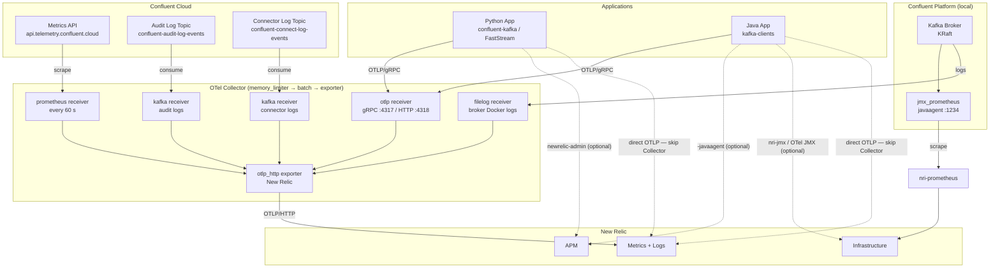

# Kafka Monitoring with New Relic

Runnable producer and consumer examples for monitoring Kafka applications and exporting metrics to New Relic via an OpenTelemetry Collector. The bundle covers Python (`confluent-kafka`, FastStream/confluent, FastStream/aiokafka) and Java (`kafka-clients`) and includes ready-to-import dashboards for both local Confluent Platform and Confluent Cloud.

> See [MONITORING.md](MONITORING.md) for a full guide to all available monitoring options — OTel SDK, New Relic Java/Python agent, nri-jmx, and OTel JMX receiver.

## Repository layout

```
applications/
  python/               Python examples (confluent-kafka, FastStream)
    confluent_kafka/    Plain confluent-kafka producer, consumer, metrics, config
    faststream_confluent/
    faststream_aiokafka/
  java/                 Java example (kafka-clients + OTel SDK)
    pom.xml
    src/main/java/com/example/kafka/
      KafkaConfig.java  Kafka client config from env vars
      KafkaMetrics.java OTel metrics instrumentation
      Producer.java
      Consumer.java

infra/
  collector/            OTel Collector configs
  dashboards/           New Relic dashboard JSON files
  jmx-exporter/         JMX Prometheus agent + rules (Confluent Platform)
  docker-compose.ccloud.yml
  docker-compose.cp.yml
  start-infra-ccloud.sh
  start-infra-cp.sh
  stop-infra-ccloud.sh
  stop-infra-cp.sh
  deploy_nr_dashboard.sh

env.example             Configuration template (copy to .env)
requirements.txt        Python dependencies
```

## Architecture


```mermaid
graph TB

    %% ── Row 1: sources ──────────────────────────────────────────────
    subgraph APPS["Applications"]
        direction LR
        PY["Python App\nconfluent-kafka / FastStream"]
        JV["Java App\nkafka-clients"]
    end

    subgraph CP["Confluent Platform (local)"]
        direction LR
        BROKER["Kafka Broker\nKRaft"]
        JMX_EXP["jmx_prometheus\njavaagent :1234"]
        BROKER --> JMX_EXP
    end

    subgraph CC["Confluent Cloud"]
        direction LR
        CAPI["Metrics API\napi.telemetry.confluent.cloud"]
        AUDIT["Audit Log Topic\nconfluent-audit-log-events"]
        CONN_T["Connector Log Topic\nconfluent-connect-log-events"]
    end

    %% ── Row 2: OTel Collector ───────────────────────────────────────
    subgraph COLLECTOR["OTel Collector  (memory_limiter → batch → exporter)"]
        direction LR
        R_OTLP["otlp receiver\ngRPC :4317 / HTTP :4318"]
        R_PROM["prometheus receiver\nevery 60 s"]
        R_FILE["filelog receiver\nbroker Docker logs"]
        R_AUDIT["kafka receiver\naudit logs"]
        R_CONN["kafka receiver\nconnector logs"]
        EXP["otlp_http exporter\nNew Relic"]
        R_OTLP --> EXP
        R_PROM --> EXP
        R_FILE --> EXP
        R_AUDIT --> EXP
        R_CONN --> EXP
    end

    %% ── Row 3: New Relic ────────────────────────────────────────────
    subgraph NR["New Relic"]
        direction LR
        NR_ML["Metrics + Logs"]
        NR_INFRA["Infrastructure"]
        NR_APM["APM"]
    end

    %% ── Main flow ───────────────────────────────────────────────────
    PY  -- "OTLP/gRPC" --> R_OTLP
    JV  -- "OTLP/gRPC" --> R_OTLP

    CAPI   -- "scrape"   --> R_PROM
    BROKER -- "logs"     --> R_FILE
    AUDIT  -- "consume"  --> R_AUDIT
    CONN_T -- "consume"  --> R_CONN

    EXP -- "OTLP/HTTP" --> NR_ML

    JMX_EXP -- "scrape" --> NRI_P["nri-prometheus"]
    NRI_P --> NR_INFRA

    %% ── Optional paths (dashed) ─────────────────────────────────────
    PY  -. "newrelic-admin (optional)" .-> NR_APM
    JV  -. "-javaagent (optional)"    .-> NR_APM
    JV  -. "nri-jmx / OTel JMX (optional)" .-> NR_INFRA
    PY  -. "direct OTLP — skip Collector"  .-> NR_ML
    JV  -. "direct OTLP — skip Collector"  .-> NR_ML
```

Applications instrument themselves with OpenTelemetry and push metrics over OTLP/gRPC to a local OpenTelemetry Collector. The Collector batches and forwards them to New Relic over OTLP/HTTP. The Collector holds the license key centrally, buffers metrics across many services, and lets you add processors without touching application code.

For simpler setups, the Collector can be skipped — see [Alternative: direct to New Relic](#alternative-direct-to-new-relic).

For Confluent Cloud, a second pipeline in the Collector scrapes the Confluent Metrics API and ingests audit and connector logs from dedicated Kafka topics.

For optional APM tracing and JVM metrics see [MONITORING.md](MONITORING.md) (dashed lines above).

## Prerequisites

* Docker and Docker Compose
* New Relic ingest key (`NEW_RELIC_LICENSE_KEY`)
* `jq` (only needed for `infra/deploy_nr_dashboard.sh`)
* **Host-only Python**: Python 3.9+, `pip install -r requirements.txt`
* **Host-only Java**: Java 17+, Maven 3.8+

## Quick start — local Kafka (Docker)

```bash
cp env.example .env
# Set NEW_RELIC_LICENSE_KEY and NEW_RELIC_OTLP_ENDPOINT in .env
# EU: https://otlp.eu01.nr-data.net  |  US: https://otlp.nr-data.net

set -a; . ./.env; set +a

# 1. Start infrastructure (Kafka broker + OTel Collector + nri-prometheus)
./infra/start-infra-cp.sh

# 2. Build application images (once, or after code changes)
docker compose -f infra/docker-compose.apps.yml build

# 3. Start an application — pick a profile:
docker compose -f infra/docker-compose.cp.yml \
               -f infra/docker-compose.apps.yml \
               --profile python-confluent up -d

# Available profiles:
#   python-confluent    confluent-kafka producer + consumer
#   python-faststream   FastStream/confluent producer + consumer
#   python-aiokafka     FastStream/aiokafka producer + consumer
#   java                Java producer + consumer (OTel SDK)
#   java-nr-agent       Java producer + consumer + New Relic APM agent
```

The apps connect to `kafka:9092` and `otel-collector:4317` on the internal Docker network — no host port exposure needed.

### New Relic APM agent (Java)

```bash
# Download the agent once
./applications/java/newrelic/download-nr-agent.sh

docker compose -f infra/docker-compose.cp.yml \
               -f infra/docker-compose.apps.yml \
               --profile java-nr-agent up -d
```

### Running on the host instead of Docker

<details>
<summary>Python (host)</summary>

```bash
python3 -m venv .venv && . .venv/bin/activate
pip install -r requirements.txt
# Note: KAFKA_BOOTSTRAP_SERVERS must be localhost:29092 (host-facing port)
python -m applications.python.confluent_kafka.consumer   # terminal 1
python -m applications.python.confluent_kafka.producer   # terminal 2
```

> Always run from the repository root — `confluent_kafka/` shares its name with the PyPI package and would shadow it if you `cd` into the directory first.
</details>

<details>
<summary>Java (host)</summary>

```bash
cd applications/java && mvn package -q && cd ../..
java -cp applications/java/target/kafka-monitoring-1.0-SNAPSHOT.jar com.example.kafka.Consumer   # terminal 1
java -cp applications/java/target/kafka-monitoring-1.0-SNAPSHOT.jar com.example.kafka.Producer   # terminal 2
```
</details>

## Quick start — Confluent Cloud

```bash
cp env.example .env
# Fill in CONFLUENT_* and KAFKA_* variables in .env

set -a; . ./.env; set +a
./infra/start-infra-ccloud.sh

# Start apps (bootstrap server is the CCloud endpoint from .env)
docker compose -f infra/docker-compose.ccloud.yml \
               -f infra/docker-compose.apps.yml \
               --profile python-confluent up -d
```

## FastStream examples

```bash
# Docker
docker compose -f infra/docker-compose.cp.yml \
               -f infra/docker-compose.apps.yml \
               --profile python-faststream up -d

# Host
python -m applications.python.faststream_confluent.consumer
python -m applications.python.faststream_confluent.producer
```

```bash
python -m applications.python.faststream_aiokafka.consumer
python -m applications.python.faststream_aiokafka.producer
```

## Alternative: direct to New Relic

Point `OTEL_EXPORTER_OTLP_ENDPOINT` at New Relic's OTLP host. The Python metrics module and Java `KafkaMetrics` both detect the `nr-data.net` hostname, enable TLS, and inject `NEW_RELIC_LICENSE_KEY` as the `api-key` header automatically — no Collector needed.

```bash
# In .env
OTEL_EXPORTER_OTLP_ENDPOINT=https://otlp.eu01.nr-data.net   # or https://otlp.nr-data.net
```

## Metrics emitted

All eight instruments are identical across Python and Java so all dashboards and NRQL queries work unchanged.

| Metric | Type | Description |
|---|---|---|
| `kafka_app.produced_records` | Counter | Records accepted by the producer |
| `kafka_app.producer_delivery_errors` | Counter | Failed delivery callbacks |
| `kafka_app.producer_delivery_latency_ms` | Histogram | `produce()` / `send()` → delivery callback |
| `kafka_app.consumed_records` | Counter | Records returned by `poll()` |
| `kafka_app.consumer_processing_errors` | Counter | Application processing failures |
| `kafka_app.consumer_processing_latency_ms` | Histogram | Application processing duration |
| `kafka_app.consumer_lag_records` | Observable gauge | Estimated lag for the consumed partition |
| `kafka_app.consumer_rebalances` | Counter | Consumer group assignment events |

Attributes: `service.name`, `deployment.environment`, `client.id`, `topic`, `consumer.group`, `partition`.

## Dashboards

| File | Description |
|---|---|
| `infra/dashboards/newrelic-dashboard-python.json` | Python app metrics (confluent-kafka, FastStream) |
| `infra/dashboards/newrelic-dashboard-java.json` | Java app metrics + JVM health (OTel SDK + JMX) |
| `infra/dashboards/newrelic-dashboard-cp.json` | Confluent Platform broker (JMX) |
| `infra/dashboards/newrelic-dashboard-ccloud.json` | Confluent Cloud cluster + consumer lag |
| `infra/dashboards/newrelic-dashboard-ccloud-logs.json` | Confluent Cloud audit + connector logs |

Deploy via script (requires `NEW_RELIC_API_KEY` and `NEW_RELIC_ACCOUNT_ID` in `.env`):

```bash
./infra/deploy_nr_dashboard.sh   # interactive picker
./infra/deploy_nr_dashboard.sh infra/dashboards/newrelic-dashboard-ccloud.json
```

## Troubleshooting

**No metrics in New Relic (Collector path)**
- `docker compose -f infra/docker-compose.cp.yml logs otel-collector` — check for export errors
- Verify `NEW_RELIC_LICENSE_KEY` is set and the OTLP endpoint matches your region

**Kafka connection failures**
- Local: use `localhost:29092` from the host
- Confluent Cloud: verify `SASL_SSL` / `PLAIN` / API key / bootstrap hostname / topic exists

**Consumer lag missing**
- Lag is an application-side estimate (high watermark − last offset). Use Confluent Cloud monitoring or `kafka-consumer-groups` for group-level lag.

## References

- [Apache Kafka Java client](https://kafka.apache.org/documentation/#producerapi)
- [Confluent Python client](https://docs.confluent.io/kafka-clients/python/current/overview.html)
- [Confluent Cloud Metrics API](https://docs.confluent.io/cloud/current/monitoring/metrics-api.html)
- [OpenTelemetry Collector](https://opentelemetry.io/docs/collector/configuration/)
- [New Relic OTLP endpoint](https://docs.newrelic.com/docs/opentelemetry/best-practices/opentelemetry-otlp/)
- [librdkafka statistics reference](https://github.com/confluentinc/librdkafka/blob/master/STATISTICS.md)
